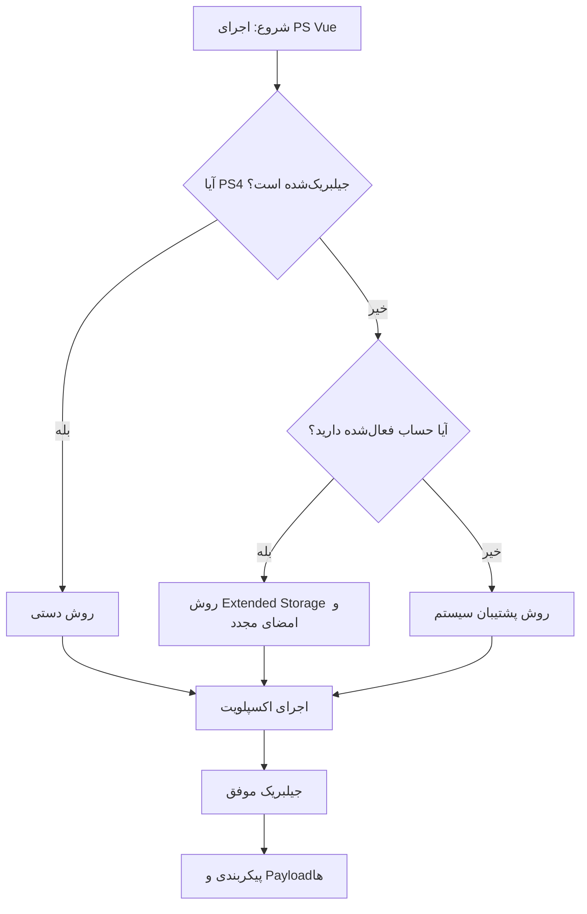

<div dir="rtl">

<p align="center">
  
</p>

<h1 align="center">Vue-After-Free</h1>

<p align="center">
  اکسپلویت اجرای کد سطح کاربر (Userland) برای PlayStation Vue روی کنسول PlayStation 4
</p>

<p align="center">
  <strong>جیلبریک پایدار و تست‌شده برای فریمورهای ۷.۰۰ تا ۱۳.۰۰</strong>
</p>

<p align="center">
  
  
  
</p>
</div>

> [!NOTE]
> **نیاز به کمک یا مواجهه با مشکل دارید؟**  
> 💡 به کانال تلگرامی ما بپیوندید: [PPPwn_PS4@](https://t.me/PPPwn_PS4) برای دریافت پشتیبانی مستقیم از جامعه توسعه‌دهندگان و کاربران.

---

## 📋 فهرست مطالب

- [📌 مقدمه](#مقدمه)
- [🎯 دامنه آسیب‌پذیری](#دامنه-آسیب‌پذیری)
- [📱 فریمورهای پشتیبانی‌شده](#فریمورهای-پشتیبانی‌شده)
- [❓ پرسش‌های متداول و عیب‌یابی](#پرسش‌های-متداول-و-عیب‌یابی)
- [📦 الزامات](#الزامات)
- [🛠️ روش‌های نصب](#روش‌های-نصب)
  - [روش ۱: PS4 از قبل جیلبریک‌شده (دستی)](#روش-۱-ps4-از-قبل-جیلبریک‌شده-دستی)
  - [روش ۲: PS4 غیرجیلبریک‌شده با Extended Storage و امضای مجدد فایل ذخیره](#روش-۲-ps4-غیرجیلبریک‌شده-با-extended-storage-و-امضای-مجدد-فایل-ذخیره)
  - [روش ۳: PS4 غیرجیلبریک‌شده با پشتیبان سیستم](#روش-۳-ps4-غیرجیلبریک‌شده-با-پشتیبان-سیستم)
- [🌐 اتصال به شبکه](#اتصال-به-شبکه)
- [🔄 به‌روزرسانی اکسپلویت Vue](#به‌روزرسانی-اکسپلویت-vue)
- [🔁 دریافت مجدد جیلبریک](#دریافت-مجدد-جیلبریک)
- [📥 Payloadهای پیش‌فرض](#payloadهای-پیش‌فرض)
- [⚙️ پیکربندی](#پیکربندی)
- [🤖 Payloadهای خودکار](#payloadهای-خودکار)
- [👤 NP-Fake-SignIn](#np-fake-signin)
- [🆙 به‌روزرسانی](#به‌روزرسانی)
- [🎨 تم‌ها](#تم‌ها)
- [👏 اعتبارها](#اعتبارها)

---

## 📌 مقدمه
<div dir="rtl">
  این **Vue-After-Free** یک اکسپلویت پیشرفته برای اجرای کد در سطح کاربر (userland) است که از آسیب‌پذیری **CVE-2017-7117** در اپلیکیشن PlayStation Vue بهره می‌برد. این اکسپلویت با اکسپلویت‌های کرنل مانند **Lapse** و **Netctrl (Poopsploit)** ترکیب می‌شود تا یک جیلبریک کامل و پایدار روی کنسول PlayStation 4 فراهم کند.

ابتدا از **CVE-2018-4441** استفاده شد، اما به دلیل ناپایداری و نرخ موفقیت پایین کنار گذاشته شد. اکنون تمرکز روی **CVE-2017-7117** برای سطح کاربر است که با اکسپلویت‌های کرنل سازگار زنجیره می‌شود.

این پروژه شامل رابط کاربری جذاب با تم‌های گربه‌ای، پشتیبانی از تم‌های سفارشی، منوی payload، گزینه‌های اجرای خودکار، حالت Lite (برای اجرای سریع بدون رابط کاربری) و چندین روش نصب برای کاربران مختلف است. این اکسپلویت از فایل ذخیره برای بارگذاری داده‌های جیلبریک از هارد دیسک استفاده می‌کند. در صورت خرابی داده‌ها، می‌توانید از `OnlineSave` برای بازیابی استفاده کنید.

اگر قبلاً جیلبریک دارید، از روش دستی استفاده کنید. اگر حساب فعال‌شده ندارید، روش پشتیبان سیستم تمام داده‌ها را پاک می‌کند. حالت Lite برای کسانی که می‌خواهند فرآیند ساده‌تری داشته باشند مناسب است.
</div>

> [!IMPORTANT]  
> 🔴 فایل ذخیره Vue ممکن است به طور تصادفی ریست شود. همیشه از فایل ذخیره رمزنگاری‌شده روی USB پشتیبان تهیه کنید تا بتوانید به راحتی بازیابی کنید.

> [!IMPORTANT]  
> 🔴 محیط NP را از طریق Debug Settings تغییر ندهید، زیرا با پشتیبان‌گیری و fake sign-in ناسازگار است.

برای درک بهتر فرآیند تصمیم‌گیری، flowchart زیر را ببینید:



---

## 🎯 دامنه آسیب‌پذیری

KEX = اکسپلویت کرنل

| اکسپلویت سطح کاربر (Vue-After-Free) | Lapse (KEX) | Netctrl (KEX) |
|---------------------------------------|-------------|---------------|
| ۵.۰۵–۱۳.۰۴                            | ۱.۰۱–۱۲.۰۲  | ۱.۰۱–۱۳.۰۰    |

---

## 📱 فریمورهای پشتیبانی‌شده

این جدول فریمورهایی را نشان می‌دهد که نسخه فعلی این مخزن جیلبریک تست‌شده و عملی برای آنها فراهم می‌کند.

| فریمورها     |
|---------------|
| 🟢 ۷.۰۰–۱۳.۰۰ |

- به طور پیش‌فرض، Lapse برای ۷.۰۰ تا ۱۲.۰۲ استفاده می‌شود و Poopsploit (Netctrl) برای ۱۲.۵۰ تا ۱۳.۰۰.
- می‌توانید Poopsploit را از ۹.۰۰ به بالا انتخاب کنید.
- اکسپلویت سطح کاربر از ۵.۰۵ تا ۱۳.۰۴ بدون تغییر کار می‌کند.

---

## ❓ پرسش‌های متداول و عیب‌یابی

**❓ سوال: آیا این روی فریمور ۱۳.۰۲ یا بالاتر کار می‌کند؟**  
✅ **پاسخ:** *فقط سطح کاربر کار می‌کند. جیلبریک کامل بالای ۱۳.۰۰ با فایل‌های این مخزن ممکن نیست*.

**❓ سوال: آیا به اتصال اینترنت نیاز دارم؟**  
✅ **پاسخ:** *خیر، اما به هر نوع اتصال شبکه‌ای (مانند هات‌اسپات موبایل، WiFi خانگی، ESP32 یا اترنت از دستگاه PPPwn) نیاز دارید. Vue بدون اتصال شبکه خطای "There was a problem connecting to the internet" نمایش می‌دهد. برای جزئیات، به [اتصال به شبکه](#اتصال-به-شبکه) مراجعه کنید*.

**❓ سوال: خطای "There is a network communication issue" دریافت می‌کنم.**  
✅ **پاسخ:** *این نشان‌دهنده به‌روزرسانی Vue یا ریست فایل ذخیره است. از پشتیبان پروفایل خود استفاده کنید یا فایل `encryptedsavebackup.zip` را روی USB باز کنید و با مدیریت داده‌های ذخیره‌شده PS4 وارد کنید. اگر داده‌ها از بین رفته، از `OnlineSave` (امضا شده به VueUser یا حساب خود) استفاده کنید. برای جزئیات بیشتر، به [دریافت مجدد جیلبریک](#دریافت-مجدد-جیلبریک) مراجعه کنید*.

**❓ سوال: حتی پس از جایگزینی فایل ذخیره، پیام "This service requires you to sign in to PlayStation Network" دریافت می‌کنم.**  
✅ **پاسخ:** *احتمالاً Vue به‌روزرسانی شده است (معمولاً به دلیل عدم استفاده از DNS یا بلاک سرورهای سونی). Vue را حذف و دوباره نصب کنید. از روش Extended Storage استفاده کنید*.

**❓ سوال: Vue را اجرا کردم و برنامه کرش کرد؟**  
✅ **پاسخ:** *اکسپلویت ناموفق بوده. کنسول را خاموش کنید و دوباره تلاش کنید*.

**❓ سوال: Vue را اجرا کردم و کنسول خاموش شد (Kernel Panic)؟**  
✅ **پاسخ:** *دکمه پاور را دو بار فشار دهید و دوباره امتحان کنید*.

**❓ سوال: چگونه payload اجرا کنم؟**  
✅ **پاسخ:** *برای payloadهای JS، Vue را ببندید و باز کنید. برای .bin یا .elf، می‌توانید پشت سر هم اجرا کنید. از منوی Payload در رابط کاربری انتخاب کنید*.

**❓ سوال: آیا جیلبریک آفلاین ممکن است؟**  
✅ **پاسخ:** *خیر، نیاز به اتصال شبکه دارید (می‌تواند محلی باشد)*.

**❓ سوال: payload شناسایی نمی‌شود؟**  
✅ **پاسخ:** *USB را به فرمت MBR و exFAT فرمت کنید*.

---

## 📦 الزامات

### برای PS4 جیلبریک‌شده
- هر نوع اتصال شبکه برای اجرای اپ.
- حساب کاربری PS4 fake یا واقعی فعال‌شده.
- دسترسی FTP به کنسول.
- درایو فلش USB.
- PlayStation Vue نسخه پایه ۱.۰۱ و پچ ۱.۲۴ ([دانلود](https://www.mediafire.com/file/45owcabezln2ykm/CUSA00960.zip/file)).

### برای PS4 غیرجیلبریک‌شده (Extended Storage و Save Resign)
- اتصال اینترنت روی PS4.
- حساب کاربری PS4 fake یا واقعی فعال‌شده.
- USB/HDD/SSD با ظرفیت ۲۵۶ گیگابایت یا بالاتر.
- ابزار امضای مجدد فایل ذخیره (PS4 جیلبریک‌شده، ربات دیسکورد یا Save Wizard).

### برای PS4 غیرجیلبریک‌شده (System Backup)
- هر نوع اتصال شبکه برای اجرای اپ.
- درایو فلش USB.
- فایل پشتیبان سیستم.

> [!WARNING]  
> ⚠️ روش پشتیبان سیستم تمام داده‌های کنسول را پاک می‌کند. از داده‌های مهم پشتیبان بگیرید.

---

## 🛠️ روش‌های نصب

<details dir="rtl">
<summary><b>🔹 روش ۱: PS4 از قبل جیلبریک‌شده (دستی)</b></summary>

اگر قبلاً جیلبریک دارید و می‌خواهید فایل‌های اکسپلویت را به‌روزرسانی کنید، از update.js استفاده کنید یا به [به‌روزرسانی اکسپلویت Vue](#به‌روزرسانی-اکسپلویت-vue) مراجعه کنید.

1. کنسول را جیلبریک کنید.
2. FTP را فعال کنید.
3. Apollo Save Tool را نصب کنید ([دانلود](https://github.com/bucanero/apollo-ps4/releases/latest)).
4. PS Vue ۱.۰۱ و پچ ۱.۲۴ را روی USB قرار دهید.
5. حساب را fake activate کنید: در Apollo به User Tools > Activate PS4 Accounts بروید، R2 سپس X فشار دهید، سپس O را نگه دارید تا به XMB برگردید، کنسول را ریستارت کنید و دوباره جیلبریک کنید.
6. با FTP به `/user/download/CUSA00960/` بروید و `download0.dat` را قرار دهید (از Releases دانلود کنید: VueManualSetup.7z یا VueLiteManualSetup.7z).
7. فایل `save.zip` را روی USB باز کنید یا به `/data/fakeusb/` FTP کنید.
8. HEN یا GoldHEN را به عنوان `payload.bin` روی USB یا `/data/` قرار دهید.
9. USB را وصل کنید، در Apollo به USB Saves بروید و ذخیره Vue را به HDD کپی کنید.
10. Vue را نصب کنید (ابتدا ۱.۰۱، سپس پچ ۱.۲۴؛ Background Installation خاموش باشد).
11. کنسول را ریبوت کنید، Vue را باز کنید، پیام PSN را OK کنید، اکسپلویت را اجرا کنید.
12. اختیاری: از [np-fake-signin](#np-fake-signin) برای جلوگیری از pop-up PSN استفاده کنید. آیکون سفارشی را در `/user/appmeta/CUSA00960` قرار دهید.

> در حالت Lite، اکسپلویت بلافاصله اجرا می‌شود. اگر از HEN استفاده می‌کنید، در config.js تأخیر را به ۲۰۰۰۰ تنظیم کنید.
</details>

<details dir="rtl">
<summary><b>🔹 روش ۲: PS4 غیرجیلبریک‌شده با Extended Storage و امضای مجدد فایل ذخیره</b></summary>

> [!WARNING]  
> ⚠️ این روش درایو خارجی را پاک می‌کند.

1. balenaEtcher را دانلود کنید ([https://etcher.balena.io](https://etcher.balena.io)).
2. VueExtStorage.7z را دانلود و استخراج کنید، تصویر .zip را فلش کنید.
3. درایو را به PS4 وصل کنید، Vue را به حافظه داخلی منتقل کنید (Settings > Storage > Extended Storage > Applications > Move to System Storage).
4. فایل `OnlineSave` را امضا مجدد کنید (به حساب فعلی؛ Account ID را از فایل ذخیره موجود پیدا کنید).
5. HEN/GoldHEN را به عنوان `payload.bin` روی USB قرار دهید.
6. فایل ذخیره را به سیستم منتقل کنید.
7. Vue را اجرا کنید، حالت (Normal یا Lite) را انتخاب کنید.

* `OnlineSave` نیاز به اینترنت دارد. پس از جیلبریک، np-fake-signin را اجرا کنید.
</details>

<details dir="rtl">
<summary><b>🔹 روش ۳: PS4 غیرجیلبریک‌شده با پشتیبان سیستم</b></summary>

> [!WARNING]  
> ⚠️ این روش تمام داده‌ها را پاک می‌کند.

1. USB را به exFAT فرمت کنید.
2. VueSystemBackup.7z یا VueLiteSystemBackup.7z را دانلود و روی USB استخراج کنید.
3. از داده‌های ذخیره و گالری پشتیبان بگیرید (اگر حساب فعال دارید).
4. به Settings > System > Back Up and Restore > Restore PS4 بروید و پشتیبان را بازگردانی کنید.
5. پس از ریبوت، کاربر fake-activated و Vue آماده است.
6. HEN/GoldHEN را به عنوان `payload.bin` روی USB قرار دهید.
7. به شبکه متصل شوید و Vue را اجرا کنید.

* شناسه حساب "1111111111111111" است. می‌توانید کاربر جدید ایجاد و fake activate کنید.
</details>

---

## 🌐 اتصال به شبکه

1. به Settings > System > Automatic Downloads بروید و "Featured Content"، "System Software Update Files" و "Application Update Files" را غیرفعال کنید.
2. به Settings > Network > Set Up Internet Connection بروید.
3. نوع اتصال را انتخاب کنید (WiFi یا LAN > Custom).
4. IP را Automatic، DHCP را Do not Specify، DNS را Manual تنظیم کنید: Primary DNS به `127.0.0.2` (فقط محلی) یا `62.210.38.117` (اینترنت با بلاک سونی).
5. MTU Automatic، Proxy Do Not Use.
6. اتصال را تست کنید.

> [!NOTE]  
> 💡 عدم موفقیت اتصال اینترنت به معنای بلاک سرورهای سونی است که هدف است.

### ایجاد کاربر جداگانه
1. کاربر جدید ایجاد کنید.
2. با Apollo fake activate کنید.
3. فایل ذخیره را کپی کنید.

---

## 🔄 به‌روزرسانی اکسپلویت Vue

1. فایل `VueManualSetup.7z` را دانلود کنید، `download0.dat` را در `/user/download/CUSA00960/` جایگزین کنید و `download0_info.dat` را حذف کنید.

### به‌روزرسانی به Lite
فایل `VueLiteManualSetup.7z` را استفاده کنید.

---

## 🔁 دریافت مجدد جیلبریک

اگر Vue به‌روزرسانی شد یا داده‌ها ریست شد:
1. ابتدا Vue را حذف کنید.
2. پایگاه داده را در Safe Mode بازسازی کنید.
3. از Extended Storage برای بازگردانی استفاده کنید.
4. از `OnlineSave` با اینترنت استفاده کنید.
5. پایگاه داده FPKG را بازسازی کنید ([راهنما](https://consolemods.org/wiki/PS4:Rebuilding_FPKG_Database)).

---

## 📥 Payloadهای پیش‌فرض

Vue با payloadهای زیر عرضه می‌شود:

- **📁 ftp-server.ts**: FTP سندباکس برای جابجایی فایل‌ها بدون جیلبریک کامل.
- **🌐 WebUI**: رابط کاربری مرورگر برای اجرای کد سطح کاربر (جایگزین jsmaf).
- **📦 elfldr.elf**: بارگذاری payloadهای elf و bin بدون HEN/GoldHEN.
- **👤 np-fake-signin**: حذف pop-up PSN (روی حساب واقعی اجرا نشود!).
- **🆙 update.js**: به‌روزرسانی فایل‌ها بدون نصب مجدد (فقط برای نسخه معمولی).

> [!IMPORTANT]  
> 🔴 پیلود np-fake-signin نباید روی حساب PSN واقعی اجرا شود.

---

## ⚙️ پیکربندی

برای اعمال تغییرات، برنامه را ببندید و باز کنید. گزینه‌ها شامل تشخیص خودکار فریمور، اجرای خودکار Lapse/Netctrl، Auto Close پس از جیلبریک، و فعال/غیرفعال موسیقی است. در منوی پیکربندی، رفتار JB را تغییر دهید.

## 🤖 Payloadهای خودکار

در config.js، فایل‌های .bin یا .elf را اضافه کنید تا پس از اکسپلویت کرنل اجرا شوند (HEN/GoldHEN را اضافه نکنید، زیرا خودکار بارگذاری می‌شوند).

مثال:
```js
autoloaderPayloads: [
  "/mnt/sandbox/download/CUSA00960/payloads/kernel_dumper.bin"
]
```

## 👤 NP-Fake-SignIn

این payload pop-up ورود PSN را حذف می‌کند. از منوی payloadها اجرا کنید.

## 🆙 به‌روزرسانی

payload update.js فایل‌های مخزن را به‌روزرسانی می‌کند (فقط برای نسخه غیر-Lite).

## 🎨 تم‌ها

تم‌ها را به `/download0/themes/` کپی کنید. تم پیش‌فرض نمونه‌ای برای ساخت تم جدید است.

---

## 👏 اعتبارها

- [c0w-ar](https://github.com/c0w-ar/) — پورتینگ Lapse و NetCtrl، مهندسی معکوس.
- [earthonion](https://github.com/earthonion) — رابط کاربری، تزریق JS، میزبانی payload، پورتینگ Netctrl، binloader، مهندسی معکوس و نصب‌کننده از راه دور.
- [ufm42](https://github.com/ufm42) — اکسپلویت سطح کاربر و مهندسی معکوس.
- [D-Link Turtle](https://github.com/iMrDJAi) — پشتیبانی عمومی برای اکسپلویت سطح کاربر.
- [Gezine](https://github.com/gezine) — تحقیق روش JS محلی و دور زدن PSN.
- [Helloyunho](https://github.com/Helloyunho) — پورت TypeScript، مهندسی معکوس.
- [Dr.Yenyen](https://github.com/DrYenyen) — تست گسترده، کنترل کیفیت، ایده‌های کاربر نهایی، روش پشتیبان سیستم و Extended Storage.
- [AlAzif](https://github.com/Al-Azif) — مرجع جدول اکسپلویت، مشاوره برنامه‌های خرده‌فروشی، رفع kpatches AIO Lapse و kpatches ۱۲.۵۰–۱۳.۰۰.
- abc — Lapse.
- [TheFlow](https://github.com/TheOfficialFloW) — NetCtrl.
- [پروژه Lua Loader](https://github.com/shahrilnet/remote_lua_loader) — پایه Lua Loader از راه دور.
- [Cryptogenic](https://github.com/Cryptogenic/PS4-6.20-WebKit-Code-Execution-Exploit) — مرجع CVE-2018-4441.
- [rebelle3](https://github.com/rebelle3/cve-2017-7117) — مرجع CVE-2017-7117.

### منابع payload:
- [elfldr.elf](https://github.com/ps4-payload-dev/elfldr) توسط John Törnblom.
- [AIOfix_network.elf](https://github.com/Gezine/BD-JB-1250/blob/main/payloads/lapse/src/org/bdj/external/aiofix_network.c) توسط Gezine.
- [np-fake-signin](https://github.com/earthonion/np-fake-signin) توسط earthonion.

موفق باشید و از جیلبریک لذت ببرید!

</div>
```
